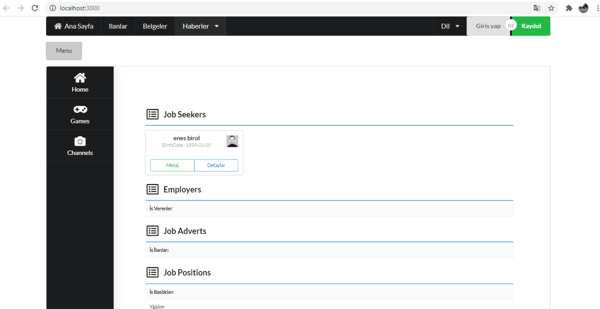
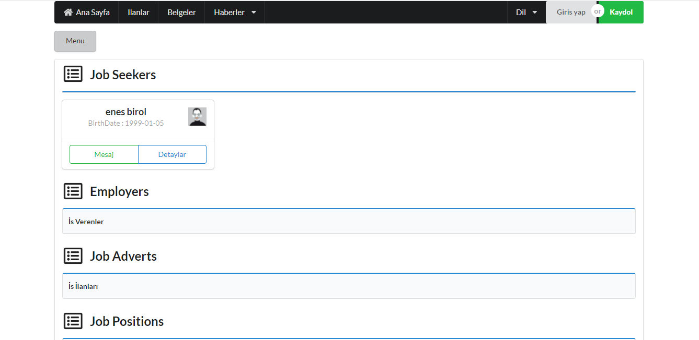

<h2> Human Resources Management System (HRMS) - React  </h2>
 

</img>

<h2>File Directory</h2>
<ul>
    <li><b>Layouts Layer </b></li>
        <ul>
            <li><a href='https://github.com/EnesBirol/hrms-react/tree/master/src/layouts'> Layouts </a>            </li>
        </ul>
    <li><b>Pages Layer</b></li>
        <ul>
            <li><a href='https://github.com/EnesBirol/hrms-react/tree/master/src/pages'> Pages </a>            </li>
        </ul>
    <li><b>Services Layer </b></li>
        <ul>
            <li><a href='https://github.com/EnesBirol/hrms-react/tree/master/src/services'> Services </a>            </li>
        </ul>
            </ul>  
    

        
UML Diagram

        </img>
    

    

    

      
Project Details

        </img>
        </img>
    

    
<ul>
